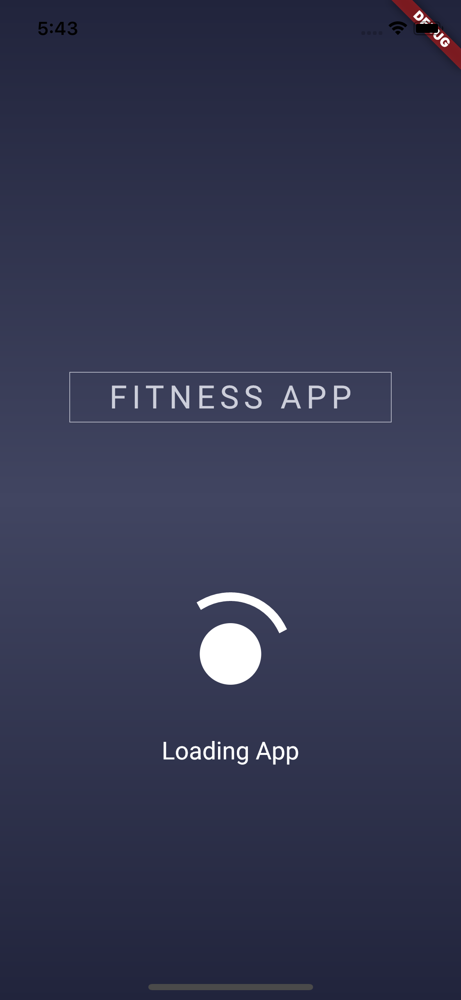
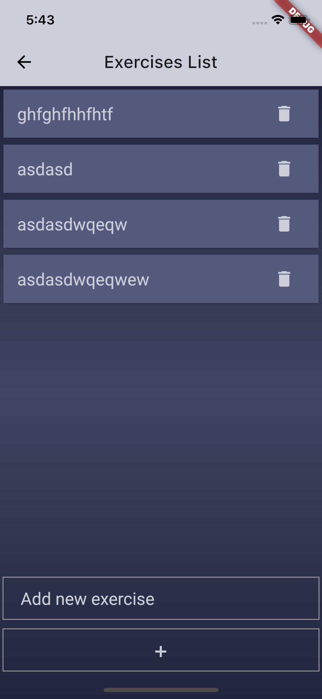
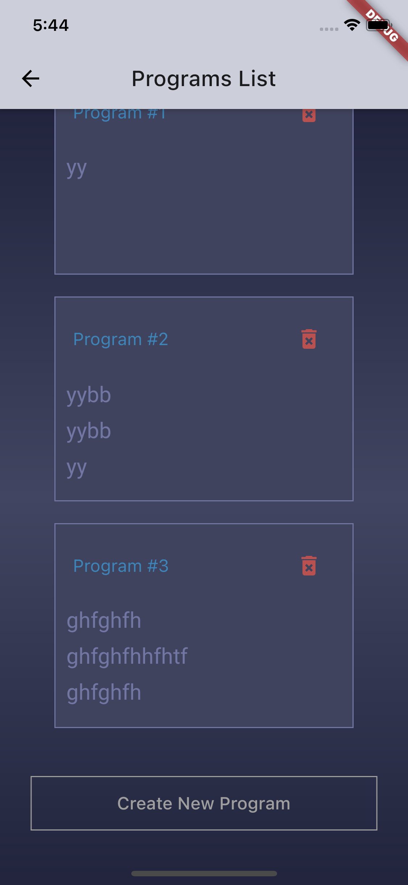
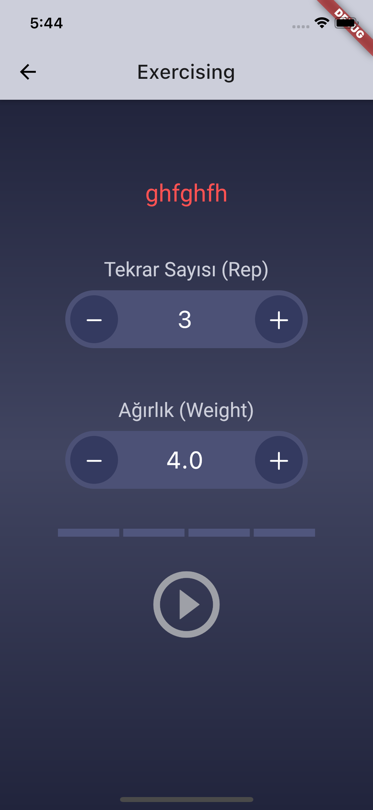
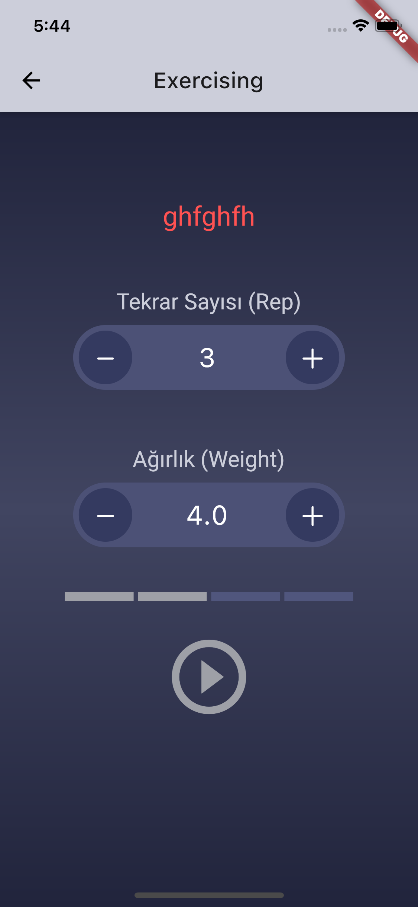

# gym_app

Fitness App developed with Flutter.

## Getting Started

This project good example for SQLite database in Flutter.

Tested On : 

- MacOs
- Web App
- iPhone Simulator
- Android 10 (Real Device)
- Android 10 Emulator

Ui taken by https://dribbble.com/shots/2123029-Free-PSD-Fitness-App-Ui-Kit 

Special Thanks.
- https://dribbble.com/bugradere

ScreenShots
- SplashScreen

- ExerciseList

- programList

- Play

